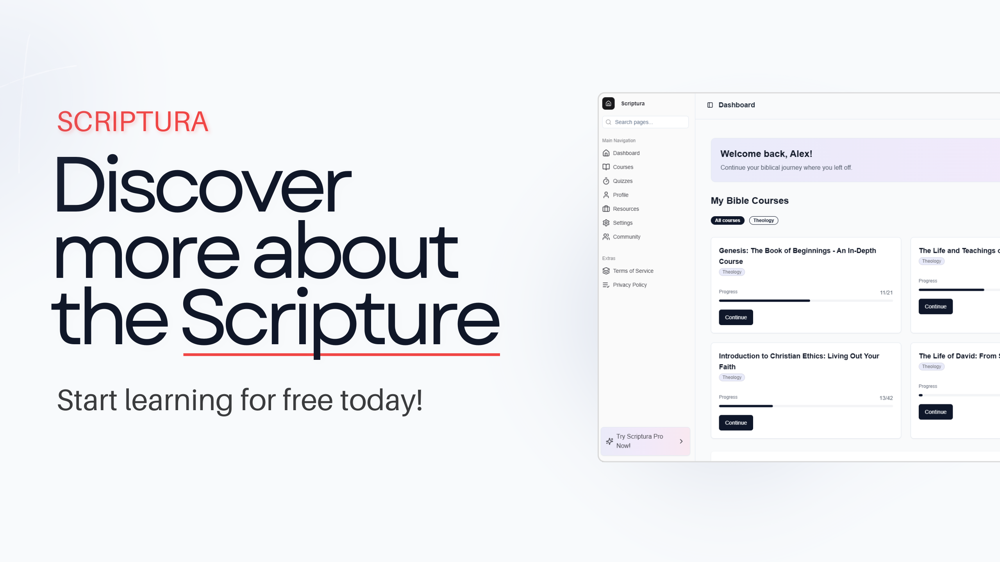

# Scriptura - Interactive Bible Learning Platform

**Your Interactive Bible Learning Platform**

## About Scriptura

*Scriptura* is a modern, web-based learning platform designed to help users explore and study the Bible interactively. Whether you're just beginning your spiritual journey or have extensive Bible knowledge, *Scriptura* provides personalized tools, quizzes, and resources to deepen your understanding.

## Table of Contents

1. **Features**
2. **Tech Stack**
3. **API**
4. **Contributing**
5. **Support**
6. **License**
7. **Version**
8. **FAQ**
9. **Contact**

## Features

- **Personalized Learning** — Track your progress with tailored suggestions and daily Bible reading prompts.
- **Bible Courses** — Deepen your knowledge of Bible characters, events, and teachings through engaging courses.
- **Bible Quizzes** — Learn more about the Bible through our quizzes. Try to get the highest score.
- **Progress Tracking** — Monitor your milestones, quiz scores, and daily Bible engagement.
- **Leaderboards** — Compete with others and see how your Bible knowledge stacks up.
- **Community Insights** — Share notes, reflections, and insights with fellow learners.
- **Daily Verses and Teachings** — Reflect on daily Bible verses and thematic lessons.

## Tech Stack

*Scriptura* leverages modern technologies to deliver optimal performance:

- **Next.js (TypeScript)** — For server-side rendering and static site generation.
- **MongoDB** — Cloud database managed by MongoDB Atlas.
- **Vercel** — Hosting and deployment for fast, reliable performance.
- **TailwindCSS** — Utility-first CSS for sleek, responsive design.
- **Bible API** — Fetch Bible verses and data for real-time content.
- **ShadCN** — Modular, accessible UI components.
- **React-Icons** — Streamlined iconography.
- **FramerMotion** — Smooth animations and transitions.
- **NextAuth** — Simple and secure authentication.
- **Stripe** — Seamless payment processing.

## API

*Scriptura* integrates with the **Bible API** to provide dynamic, real-time access to Bible verses and related content. Learn more about the API [here](https://rapidapi.com/ajith/api/holy-bible).

## Contributing

We welcome contributions! To get involved:

1. **Fork the repository** and create a new branch.
2. **Implement your changes** with clear commit messages.
3. **Submit a pull request** describing your contributions.

> *Every contribution helps improve Scriptura — thank you!*  

## Support

Interested in supporting *Scriptura*? Spread the word, or contribute directly by enhancing the platform’s features and functionality.

## License

*Scriptura* is licensed under the **MIT License** — allowing reuse and modification with proper attribution.

## Version

**Current Version:** *v1.0*

## FAQ

**Is Scriptura free to use?**  
Yes! *Scriptura* is completely free to use. Want more? The Pro plan is available for just €9.99/month.

**What Bible translations are supported?**  
We currently support multiple translations, including the **King James Version** — with plans to expand.

**How can I report a bug or suggest a feature?**  
Open an issue on our GitHub repository with details of the bug or suggestion.

## Contact

For questions, feedback, or collaboration opportunities, reach out via email: [devlamper06@gmail.com](mailto:devlamper06@gmail.com)

---

Thank you for exploring *Scriptura* — we hope it enriches your Bible learning experience.

